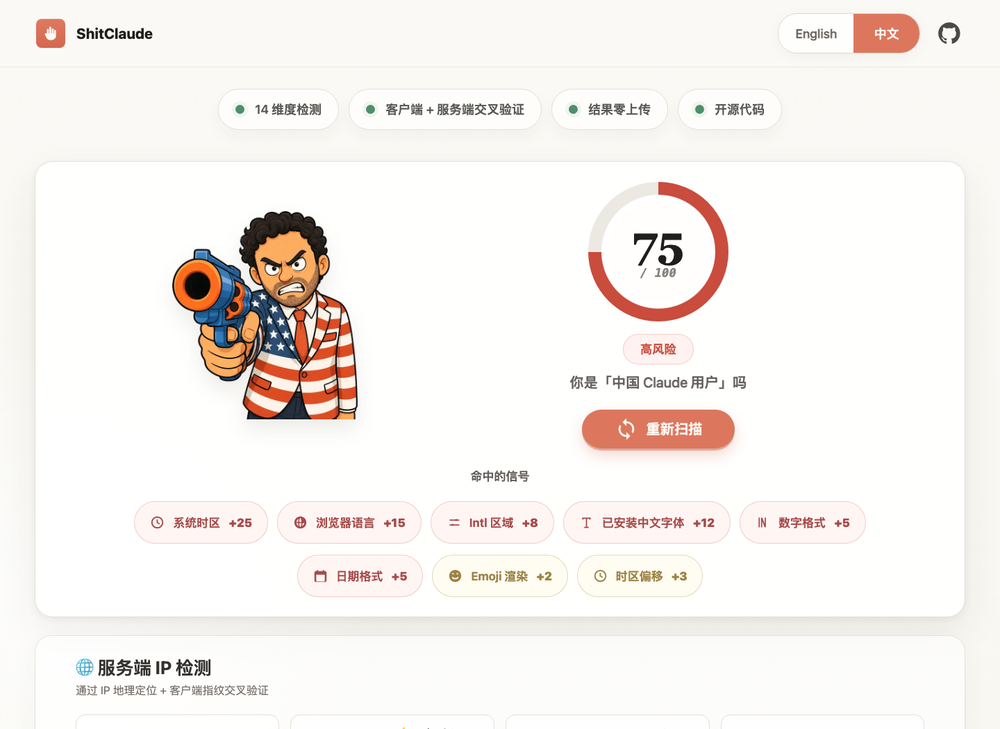

# ShitClaude

Private-by-default Claude and Codex region profile scanner.

[Open the live scanner](https://shitclaude.site/zh/) · [Methodology](https://shitclaude.site/methodology/) · [Privacy](https://shitclaude.site/privacy/)

[](https://shitclaude.site/zh/)

Click the screenshot to run the live scanner.

ShitClaude is a tiny browser-based tool that shows how regional fingerprints can make a Claude or Codex user look "non-US" or "high risk". It combines local browser signals with optional server-side IP geolocation, turns them into a 0-100 score, and explains which signals contributed to the result.

It is not affiliated with Anthropic, Claude, OpenAI, or Codex. The project is a research and education demo with an intentionally irreverent brand.

## 中文介绍

ShitClaude 是一个本地优先的 Claude / Codex 地区画像检测工具，用来展示你的浏览器和网络环境会暴露哪些“地区特征”：系统时区、浏览器语言、Intl 区域、中文字体、WebGL/GPU、数字和日期格式、键盘布局、屏幕 DPI、Emoji 渲染，以及服务端 IP 地理位置。

点击上面的效果图即可进入在线检测。

它会把这些信号加权成 0-100 的风险分，并解释每一项命中的原因。项目默认不需要登录、不接数据库、不上传检测结果；只有 IP 检测会通过 `/api/geo` 做一次地理位置查询。

这个项目适合：

- 想了解 Claude / Codex 地区风控信号的用户
- 想学习浏览器指纹和 IP 交叉验证的开发者
- 想做轻量工具站、SEO 页面和 AdSense 变现验证的独立开发者

免责声明：ShitClaude 不是 Anthropic、Claude、OpenAI 或 Codex 的官方项目，分数只是外部可见信号的估计，不代表真实封号结论。

## Why This Exists

AI coding tools and model providers can see more than the prompt you type. Locale, timezone, IP, fonts, GPU renderer, and browser formatting APIs can all create a surprisingly strong regional profile.

ShitClaude makes that profile visible:

- Developers can see what their browser and machine expose.
- Privacy-minded users can understand which signals matter.
- Indie builders can fork a simple static tool site and study a local-first implementation.

## Features

- 14 weighted detection dimensions
- Multi-country matching for China, UK, Canada, Australia, Singapore, Japan, Korea, Germany, France, Brazil, and India
- Claude and Codex risk framing
- Browser-only checks for timezone, locale, fonts, WebGL, number/date format, keyboard layout, screen DPI, emoji rendering, and timezone offset
- Optional Vercel serverless IP geolocation endpoint
- No login, no database, no analytics required
- Bilingual UI foundation: Chinese and English strings are already in the client
- Remotion promo video source under `src/`
- SEO basics: `robots.txt`, `sitemap.xml`, and `llms.txt`
- MIT licensed

## Privacy Model

Most checks run entirely in the browser.

The only server call is `GET /api/geo`, which reads the request IP, asks ip-api.com for geolocation metadata, and returns the result to the browser. The repository does not include a database, logging pipeline, user account system, or result upload endpoint.

If you deploy your own fork, your hosting provider may still keep access logs. If you enable Google AdSense, Analytics, or any other third-party script, update `privacy/index.html` and your consent flow accordingly.

## Tech Stack

- Static HTML, CSS, and vanilla JavaScript for the scanner
- Vercel Serverless Function for IP geolocation
- Node test runner with Happy DOM
- Remotion + React for the vertical promo video

## Project Structure

```text
.
├── api/geo.js              # IP geolocation serverless function
├── index.html              # Redirects to /zh/
├── methodology/            # Methodology page for SEO and transparency
├── privacy/                # Privacy policy for ads and trust
├── public/mascot/          # Mascot image assets
├── public/preview/         # README screenshots
├── tests/script.test.js    # Unit tests for scoring and DOM assumptions
├── zh/                     # Main static scanner page
├── src/                    # Remotion promo video composition
├── robots.txt
├── sitemap.xml
├── llms.txt
├── LICENSE
├── remotion.config.ts
├── package.json
└── vercel.json
```

## Local Development

Install dependencies:

```bash
npm install
```

Run tests:

```bash
npm test
```

Open the scanner locally with any static file server. For example:

```bash
npx serve .
```

Then visit:

```text
http://localhost:3000/zh/
```

## Video

Preview the Remotion composition:

```bash
npm run video:preview
```

Render the vertical promo video:

```bash
npm run video:render
```

The render script exports image frames with Remotion and stitches them with system `ffmpeg`. This avoids platform-specific compositor issues on older macOS versions.

## Deploy

The project is designed for Vercel:

1. Import the repository in Vercel.
2. Keep the output directory as `.`.
3. Add your custom domain.
4. Visit `/zh/`.

No environment variables are required by default.

## AdSense and Monetization

This site can support AdSense once it has enough original content, stable navigation, and a privacy policy that discloses advertising cookies and third-party ad serving.

The repository intentionally does not ship with an active AdSense ad unit. Add it only after your AdSense site is approved and you have a real ad slot ID:

```html
<script
  async
  src="https://pagead2.googlesyndication.com/pagead/js/adsbygoogle.js?client=ca-pub-YOUR_PUBLISHER_ID"
  crossorigin="anonymous"
></script>

<ins
  class="adsbygoogle"
  style="display:block"
  data-ad-client="ca-pub-YOUR_PUBLISHER_ID"
  data-ad-slot="YOUR_AD_SLOT_ID"
  data-ad-format="horizontal"
  data-full-width-responsive="true"
></ins>
<script>
  (adsbygoogle = window.adsbygoogle || []).push({});
</script>
```

Copy `ads.txt.example` to `ads.txt` and replace the publisher ID before production.

Recommended monetization path:

1. Keep the scanner useful and fast.
2. Expand static content pages: Claude risk guide, Codex risk guide, country-specific pages, browser fingerprint guide.
3. Submit the site to Google Search Console and Bing Webmaster Tools.
4. Add AdSense only after the site has real content and organic traffic.
5. Never ask users to click ads or place ads where they look like controls.

If you fork this repository, replace any production ad client or slot IDs with your own values before deployment.

## Open Source Readiness Notes

Before publishing a public GitHub repository:

- Review `LICENSE` and adjust it if MIT is not what you want.
- Do not commit `.env`, `.vercel/`, `.claude/`, `.codex/`, local agent files, generated videos, or `node_modules/`.
- Consider using a GitHub noreply email if you do not want your personal email visible in commit metadata.
- If you previously pushed internal refs or sidecar metadata, publish from a clean repository instead of pushing all refs.
- Replace account-specific ad IDs in forks or templates.

## Disclaimer

The score is an approximation, not an official Claude, Anthropic, OpenAI, or Codex decision. Real provider-side risk systems can include additional signals such as account history, payment method, phone number, abuse patterns, and network reputation.

Use this project to understand browser and network fingerprints, not to bypass service terms.
